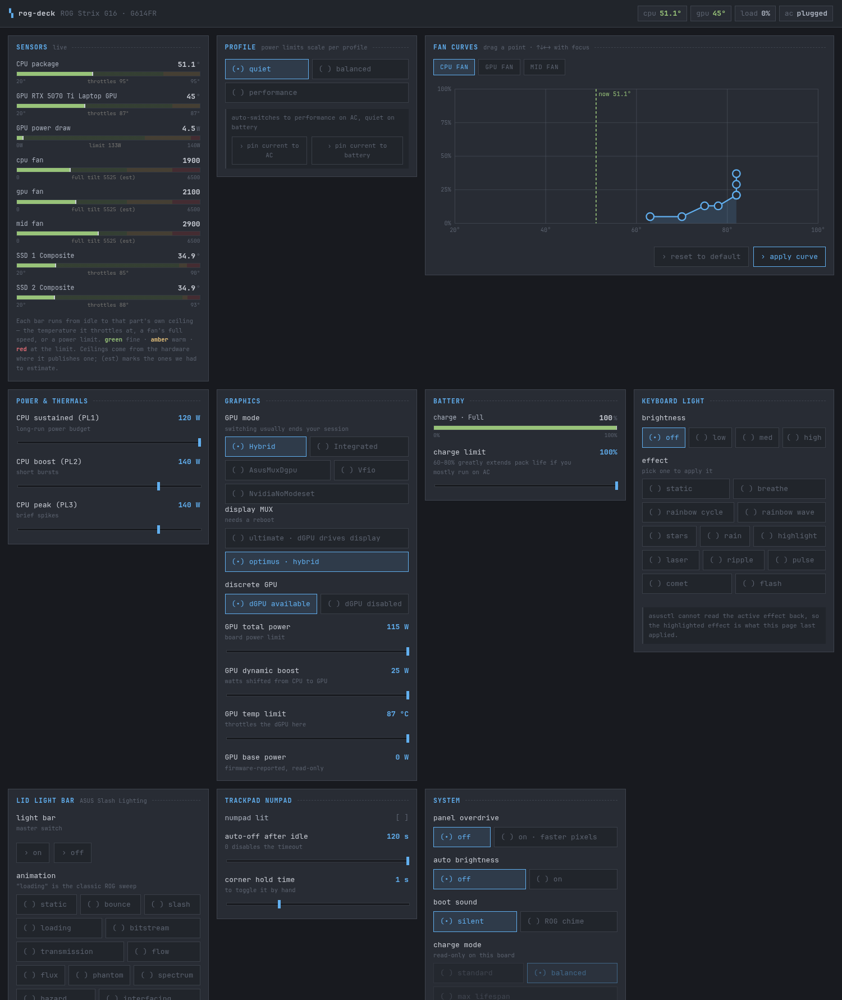

# ROG Deck

An Armoury Crate replacement for Linux, in your browser.

ASUS ships no control software for Linux, and `rog-control-center` leaves most
of the interesting firmware knobs untouched. ROG Deck exposes them: per-profile
fan curves you can drag, CPU power limits, GPU MUX and power, battery charge
care, keyboard Aura, the lid Slash light bar, and the trackpad NumberPad.

Built for Omarchy / Hyprland, but it is a plain local web page and works on any
desktop.



## Features

- **Performance profiles** — Quiet / Balanced / Performance. The firmware
  re-scopes every power limit per profile, so the UI re-reads them on switch.
- **Fan curves** — drag the eight firmware points for the CPU, GPU and mid
  fans, with a live marker showing the current temperature. Keyboard accessible.
- **Power & thermals** — `ppt_pl1_spl`, `ppt_pl2_sppt`, `ppt_pl3_fppt`.
- **Graphics** — `supergfxctl` mode switching, GPU MUX, dGPU enable, total
  board power, dynamic boost and thermal target.
- **Battery** — charge limit (the big one for longevity) and live status.
- **Lighting** — Aura brightness and all twelve keyboard effects. Each effect
  only offers the controls it actually accepts, because `asusctl` hard-errors
  when handed an argument an effect does not support (passing a colour to
  `rainbow-cycle` is a failure, not a no-op).
- **Slash lid light bar** — enable, brightness, and all sixteen animations
  including the classic `Loading` sweep.
- **NumberPad** — a real on/off switch for `asus-numberpad-driver`, so you
  don't have to hold the trackpad corner, plus hold-time and auto-off tuning.
- **Live telemetry with context** — every reading is a gauge showing where the
  value sits between idle and that part's own ceiling, so you can tell "warm"
  from "about to throttle" at a glance. Ceilings come from the hardware where
  it publishes them (NVMe `temp1_crit`, the firmware's `nv_temp_target`,
  nvidia's power limit) and are marked `(est)` where they had to be estimated.
- **Follows your Omarchy theme** — colours are read from the active theme's
  `colors.toml`, so `omarchy theme set` re-themes the dashboard too.

Controls are generated from `/sys/class/firmware-attributes/asus-armoury`,
which is self-describing (type, range, defaults, enum values). Anything your
firmware exposes shows up, so this is not hard-coded to one laptop model.

## Requirements

- Linux with `asusd` running (`asusctl` package)
- Python 3.11+ — **no third-party Python packages**, only the standard library
- Optional: `supergfxctl` for GPU mode switching, `nvidia-smi` for dGPU
  telemetry, `asus-numberpad-driver` for NumberPad control

## Install

```bash
git clone https://github.com/97d110/rog-deck ~/.local/src/rog-deck
cd ~/.local/src/rog-deck
./install.sh
```

Then open <http://127.0.0.1:8737>, or launch "ROG Deck" from your app menu.

Remove it again with `./uninstall.sh`. Neither script changes hardware settings.

## Running it by hand

```bash
rog-deck                      # loopback, port 8737
rog-deck --port 9000
rog-deck --interval 1.0       # sensor poll interval, seconds
ROG_DECK_DEBUG=1 rog-deck     # log every request
```

## Security

The server **binds to loopback only** by default and has **no authentication**,
because it changes hardware settings. `--host 0.0.0.0` will expose it to your
whole network — it prints a warning, and you should only do it on a network you
trust.

ROG Deck itself never runs as root. It reads sysfs (world-readable) and hands
every privileged write to `asusd` over D-Bus via `asusctl`, which does its own
authorization.

## How it talks to the hardware

| Area | Read from | Written via |
| --- | --- | --- |
| Firmware attributes | `/sys/class/firmware-attributes/asus-armoury` | `asusctl armoury set` |
| Platform profile | `/sys/firmware/acpi/platform_profile` | `asusctl profile set` |
| Fan curves | `asusctl fan-curve` | `asusctl fan-curve` |
| Battery limit | `/sys/class/power_supply/BAT*` | `asusctl battery limit` |
| Aura / Slash | `asusctl leds`, `asusctl slash --list` | `asusctl aura`, `asusctl slash` |
| GPU mode | `supergfxctl -g` | `supergfxctl -m` |
| Sensors | `/sys/class/hwmon`, `nvidia-smi` | — |
| NumberPad | driver ini file | driver ini file |

## Known limits

- `asusctl` cannot read back Aura effects or Slash state, so those controls
  show the action taken rather than stored state. Everything else reflects
  real hardware state.
- `charge_mode` is reported by firmware but rejected on write on some boards,
  so it renders read-only.
- Switching the GPU MUX needs a reboot; switching `supergfxctl` modes normally
  ends your session. Both are confirmed before they run.

## Tested on

ROG Strix G16 (G614FR) — Ryzen 9 9955HX, RTX 5070 Ti Laptop, Omarchy /
Hyprland, kernel 7.1, asusctl 6.3.8.

Reports from other ROG models welcome.

## Licence

MIT
